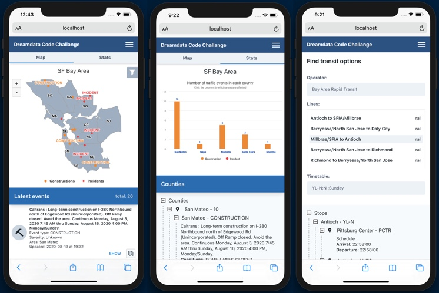

# This is the repo of the application built for the DREAMDATA.IO code challange

## Project layout
### React Application and it's packages:
        ⁃	React
        ⁃	511 SF Bay Open Data APIs (traffic events, transit)
            https://511.org/
        ⁃	Blueprintjs
            https://blueprintjs.com/
        -   Highcharts
            https://www.highcharts.com/
        -   Dotenv
            https://www.npmjs.com/package/dotenv
        -   Google-Map-React
            https://github.com/google-map-react/google-map-react
        -   Proj4 - JavaScript library to transform coordinates from one coordinate system to another (required for     Highcharts)
            http://proj4js.org/
        -   Tailwind.css
            https://tailwindcss.com/
        -   Styled components
            https://styled-components.com/

## Current state
### Features:

    - Events page:
        - MAP view:
            - Interactive MAP CHART displaying traffic events
            - Detailed list of events -> can show on chart or Google Maps
            - List of events/areas can be filtered
        - STATS view:
            - Interactive COLUMN CHART displaying categorized traffic events
            - Detailed list of events in an animated collapsable tree view
    - Transit page:
        - You can select a preferred provider from a list
        - Then select a preferred line on which the provider operates
        - After that you can select one of the available timetables
        - Once all the above is specified we display a detailed schedule with all the stops
          for a specified route
    
    (The project is responsive, however the main focus was on the mobile layout - due to the context of the data that is being displayed considering the use cases)

## To run the project

    - Clone the repo
    - $ yarn install
    - $ yarn start

### `yarn start`

Runs the app in the development mode. 
Open [http://localhost:3000](http://localhost:3000) to view it in the browser.